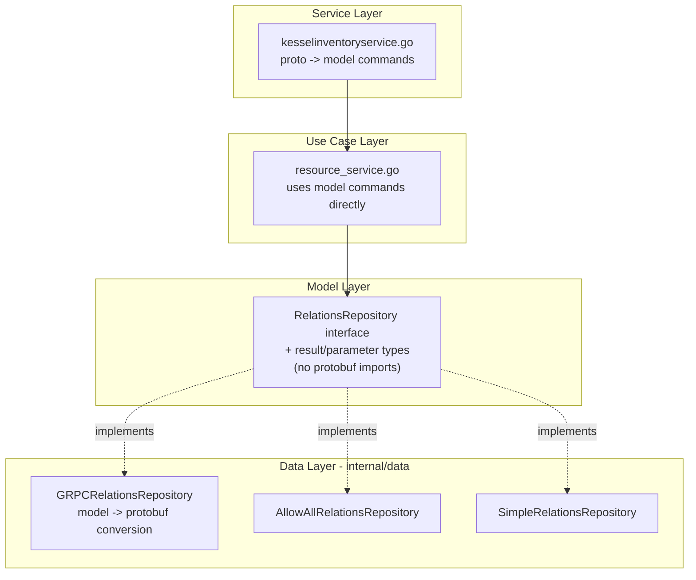

# Refactor Authorizer Interface to Use Model Types

## Current State

The `RelationsRepository` interface in [`internal/biz/model/relations_repository.go`](internal/biz/model/relations_repository.go) currently imports and uses Relations API protobuf types (`v1beta1.SubjectReference`, `v1beta1.CheckBulkRequest`, `grpc.ServerStreamingClient`, etc.) directly in its method signatures. This couples the domain model to an external gRPC API.

Protobuf-to-model conversion currently happens **in the use case layer** ([`internal/biz/usecase/resources/resource_service.go`](internal/biz/usecase/resources/resource_service.go) lines 659-920) and **in the consumer** ([`internal/consumer/consumer.go`](internal/consumer/consumer.go) lines 776-838). This conversion should instead happen in the infrastructure implementation.

**Files that import Relations API protobuf types:**
- `internal/biz/model/relations_repository.go` -- the interface itself
- `internal/biz/usecase/resources/resource_service.go` -- conversion helpers + direct use
- `internal/consumer/consumer.go` -- tuple conversion + direct use
- `internal/data/grpc_relations_repository.go` -- gRPC implementation (stays)
- `internal/data/relations_allow_all.go` -- allow-all stub
- `internal/data/relations_simple.go` -- in-memory test double
- `internal/data/health/healthrepository.go` -- Health() response type
- `internal/mocks/mocks.go` -- test mock

## Interface Before and After

### BEFORE (current) -- protobuf types leak into the model

```go
package model

import (
    "context"
    "google.golang.org/grpc"
    kesselv1 "github.com/project-kessel/relations-api/api/kessel/relations/v1"
    kessel "github.com/project-kessel/relations-api/api/kessel/relations/v1beta1"
)

type RelationsRepository interface {
    Health(ctx context.Context) (*kesselv1.GetReadyzResponse, error)
    Check(ctx context.Context, namespace string, permission string, consistencyToken string,
        resourceType string, localResourceId string, sub *kessel.SubjectReference,
    ) (kessel.CheckResponse_Allowed, *kessel.ConsistencyToken, error)
    CheckForUpdate(ctx context.Context, namespace string, permission string,
        resourceType string, localResourceId string, sub *kessel.SubjectReference,
    ) (kessel.CheckForUpdateResponse_Allowed, *kessel.ConsistencyToken, error)
    CheckBulk(context.Context, *kessel.CheckBulkRequest) (*kessel.CheckBulkResponse, error)
    CheckForUpdateBulk(context.Context, *kessel.CheckForUpdateBulkRequest) (*kessel.CheckForUpdateBulkResponse, error)
    LookupResources(ctx context.Context, in *kessel.LookupResourcesRequest) (grpc.ServerStreamingClient[kessel.LookupResourcesResponse], error)
    LookupSubjects(ctx context.Context, in *kessel.LookupSubjectsRequest) (grpc.ServerStreamingClient[kessel.LookupSubjectsResponse], error)
    CreateTuples(context.Context, *kessel.CreateTuplesRequest) (*kessel.CreateTuplesResponse, error)
    DeleteTuples(context.Context, *kessel.DeleteTuplesRequest) (*kessel.DeleteTuplesResponse, error)
    AcquireLock(context.Context, *kessel.AcquireLockRequest) (*kessel.AcquireLockResponse, error)
    UnsetWorkspace(context.Context, string, string, string) (*kessel.DeleteTuplesResponse, error)   // DEAD CODE
    SetWorkspace(context.Context, string, string, string, string, bool) (*kessel.CreateTuplesResponse, error)   // DEAD CODE
}
```

Problems: imports `relations-api` protobuf packages, uses `grpc.ServerStreamingClient`, exposes protobuf enums (`CheckResponse_Allowed`), passes bare strings without semantic meaning (`namespace`, `permission`, `consistencyToken`, `resourceType`, `localResourceId`), includes dead methods (`SetWorkspace`, `UnsetWorkspace`) with no callers.

### AFTER (proposed) -- model types only, no protobuf imports

Follows the same style as `ResourceRepository`: individual model-typed parameters, no command/query structs. Command types remain in the application/use case layer (`commands.go`), not on the repository interface.

```go
package model

import "context"

type RelationsRepository interface {
    Health(ctx context.Context) (HealthResult, error)

    Check(ctx context.Context, resource ReporterResourceKey, relation Relation,
        subject SubjectReference, consistency Consistency,
    ) (CheckResult, error)

    CheckForUpdate(ctx context.Context, resource ReporterResourceKey, relation Relation,
        subject SubjectReference,
    ) (CheckResult, error)

    CheckBulk(ctx context.Context, items []CheckBulkItem, consistency Consistency,
    ) (CheckBulkResult, error)

    CheckForUpdateBulk(ctx context.Context, items []CheckBulkItem,
    ) (CheckBulkResult, error)

    LookupResources(ctx context.Context, resourceType ResourceType, reporterType ReporterType,
        relation Relation, subject SubjectReference, pagination *Pagination, consistency Consistency,
    ) (ResultStream[LookupResourcesItem], error)

    LookupSubjects(ctx context.Context, resource ReporterResourceKey, relation Relation,
        subjectType ResourceType, subjectReporter ReporterType, subjectRelation *Relation,
        pagination *Pagination, consistency Consistency,
    ) (ResultStream[LookupSubjectsItem], error)

    CreateTuples(ctx context.Context, tuples []RelationsTuple, upsert bool, fencing *FencingCheck,
    ) (TuplesResult, error)

    DeleteTuples(ctx context.Context, tuples []RelationsTuple, fencing *FencingCheck,
    ) (TuplesResult, error)

    AcquireLock(ctx context.Context, lockId string) (AcquireLockResult, error)

}
```

Changes: zero external imports, bare strings replaced with typed model parameters (`ReporterResourceKey`, `Relation`, `SubjectReference`, `Consistency`), protobuf enums replaced with model result types (`CheckResult`, `TuplesResult`), streaming uses domain-level `ResultStream[T]` instead of `grpc.ServerStreamingClient`, dead methods removed (`SetWorkspace`, `UnsetWorkspace`). Command/query structs stay in the use case layer where they belong.

## Design

### New Model Types

Only result types, parameter types used by the interface, and the streaming abstraction go in the model. Command/query structs stay in the use case layer ([`commands.go`](internal/biz/usecase/resources/commands.go)).

**Result types** (new in model):
- **`CheckResult`**: `Allowed bool`, `ConsistencyToken`
- **`CheckBulkItem`**: `Resource ReporterResourceKey`, `Relation`, `Subject SubjectReference` (used as a parameter type by `CheckBulk`/`CheckForUpdateBulk`)
- **`CheckBulkResultItem`**: `Allowed bool`, `Error error`, `ErrorCode int32`
- **`CheckBulkResultPair`**: `Request CheckBulkItem`, `Result CheckBulkResultItem`
- **`CheckBulkResult`**: `Pairs []CheckBulkResultPair`, `ConsistencyToken`
- **`TuplesResult`**: `ConsistencyToken` (shared by CreateTuples, DeleteTuples, SetWorkspace, UnsetWorkspace)
- **`AcquireLockResult`**: `LockToken string`
- **`HealthResult`**: `Status string`, `Code int`
- **`LookupResourcesItem`**: `ResourceId LocalResourceId`, `ResourceType`, `ReporterType`, `ContinuationToken string`
- **`LookupSubjectsItem`**: `Subject SubjectReference`, `ContinuationToken string`

**Parameter types** (new in model):
- **`FencingCheck`**: `LockId string`, `LockToken string`

**Streaming abstraction** (new in model):
- **`ResultStream[T]`**: interface with `Recv() (T, error)`, returns `io.EOF` when done

**Already existing** model types reused by the interface: `ReporterResourceKey`, `Relation`, `SubjectReference`, `Consistency`, `ConsistencyToken`, `RelationsTuple`, `Pagination`, `ResourceType`, `ReporterType`, `LocalResourceId`

### Data Flow After Refactoring



### Streaming Abstraction

Define a minimal streaming interface in the model to replace `grpc.ServerStreamingClient`:

```go
type ResultStream[T any] interface {
    Recv() (T, error) // returns io.EOF when done
}
```

The gRPC implementation wraps the `grpc.ServerStreamingClient` in an adapter that converts protobuf responses to model types. The service layer then converts model items to inventory proto responses.

### Implementation Layer

All implementation files stay in `internal/data/` where they already live. `RelationsRepository` is a peer to `ResourceRepository` and the existing `internal/data/` package already serves as the infrastructure/persistence layer. No package move is needed.

- `internal/data/grpc_relations_repository.go` -- absorbs all protobuf conversion (currently in use case and consumer layers)
- `internal/data/relations_allow_all.go` -- updated to return model types
- `internal/data/relations_simple.go` -- updated to return model types (test double)
- `internal/data/relations_factory.go` -- unchanged (already returns `model.RelationsRepository`)

Config stays in `internal/config/relations/` and `internal/config/relations/kessel/` as-is.

### Consumer Updates

[`internal/consumer/consumer.go`](internal/consumer/consumer.go) currently builds `v1beta1.CreateTuplesRequest`, `v1beta1.DeleteTuplesRequest`, and `v1beta1.AcquireLockRequest` directly. After the refactoring:
- `CreateTuple()` calls `Relations.CreateTuples(ctx, tuples, upsert, fencing)` with `[]model.RelationsTuple` (already available) and `*model.FencingCheck`
- `DeleteTuple()` calls `Relations.DeleteTuples(ctx, tuples, fencing)` with `[]model.RelationsTuple`
- `RebalanceCallback()` calls `Relations.AcquireLock(ctx, lockId)`
- Remove all `convertTuplesToRelationships` / `convertTupleToFilter` helpers (conversion moves to data layer)

### Use Case Layer Cleanup

[`internal/biz/usecase/resources/resource_service.go`](internal/biz/usecase/resources/resource_service.go) currently has ~260 lines of v1beta1 conversion helpers (lines 659-920). After refactoring:
- `checkPermission()` calls `Relations.Check(ctx, resource, relation, subject, consistency)` directly with model types
- `CheckForUpdate()` calls `Relations.CheckForUpdate(ctx, resource, relation, subject)`
- `CheckBulk()` / `CheckSelfBulk()` call `Relations.CheckBulk(ctx, items, consistency)` with `[]model.CheckBulkItem`
- `LookupResources()` / `LookupSubjects()` return `model.ResultStream[T]` instead of `grpc.ServerStreamingClient`
- All `*ToV1beta1` / `*FromV1beta1` conversion functions are **deleted** from this file
- Command types in [`commands.go`](internal/biz/usecase/resources/commands.go) stay in the use case layer; `CheckBulkItem` moves to model since it is a repository parameter type

### Health Repository Update

[`internal/data/health/healthrepository.go`](internal/data/health/healthrepository.go) calls `Relations.Health()` and uses `*kesselv1.GetReadyzResponse`. After refactoring it uses `model.HealthResult` instead.

### Test Updates

- [`internal/mocks/mocks.go`](internal/mocks/mocks.go): Update `MockRelationsRepository` method signatures
- [`internal/data/relations_simple.go`](internal/data/relations_simple.go): Update `SimpleRelationsRepository` to implement new interface (~722 lines)
- [`internal/biz/usecase/resources/resource_service_test.go`](internal/biz/usecase/resources/resource_service_test.go): Remove v1beta1 assertions, use model types
- [`internal/service/resources/kesselinventoryservice_test.go`](internal/service/resources/kesselinventoryservice_test.go): Update lookup response handling
- [`internal/consumer/consumer_test.go`](internal/consumer/consumer_test.go): Update tuple/lock test expectations

## Key Decision Points

1. **FencingCheck**: The consumer uses `v1beta1.FencingCheck` with `LockId`/`LockToken`. A model-level `FencingCheck` type is needed as a parameter type.

2. **DeleteTuples parameter**: The consumer currently builds `v1beta1.RelationTupleFilter` with many optional fields. The interface uses `[]RelationsTuple` instead; the data layer implementation derives the filter from the tuples.

3. **SetWorkspace / UnsetWorkspace**: Removed. No callers outside implementations and panicking mock stubs. Delete from the interface, `GRPCRelationsRepository`, `AllowAllRelationsRepository`, `SimpleRelationsRepository`, and `MockRelationsRepository`.

4. **CheckBulk response pairing**: The current bulk result includes error codes per item. This logic (`checkBulkResultFromV1beta1`) moves into the gRPC implementation so the model-level result is already clean.
