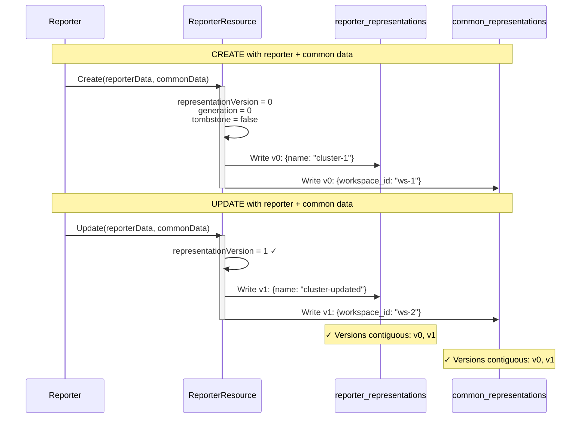
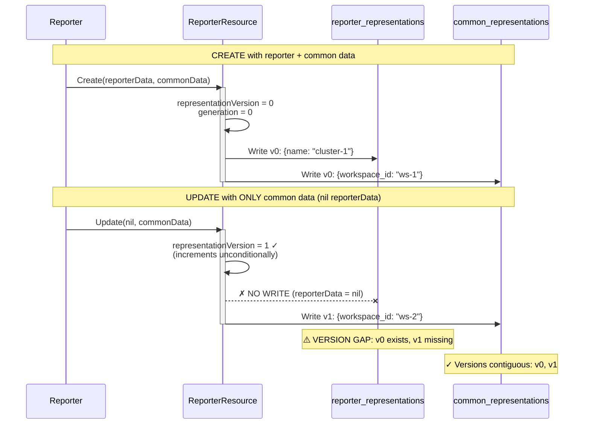
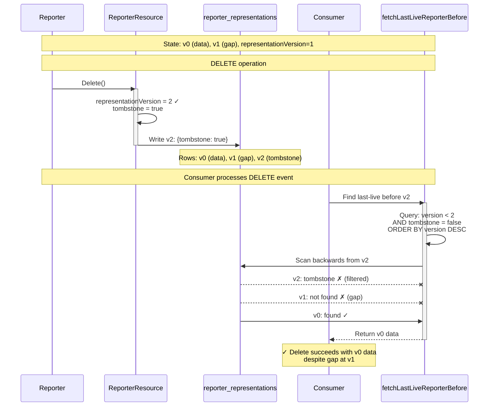
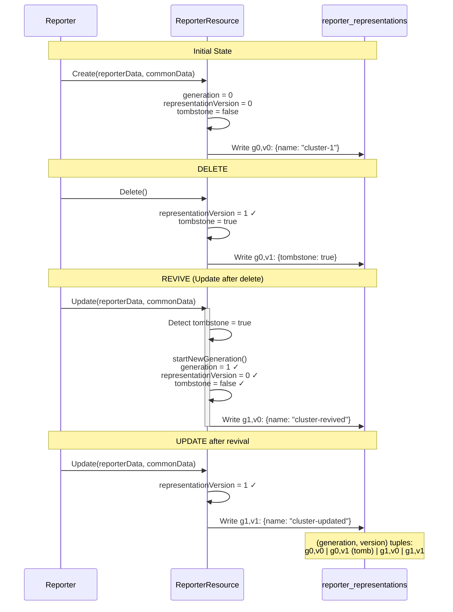
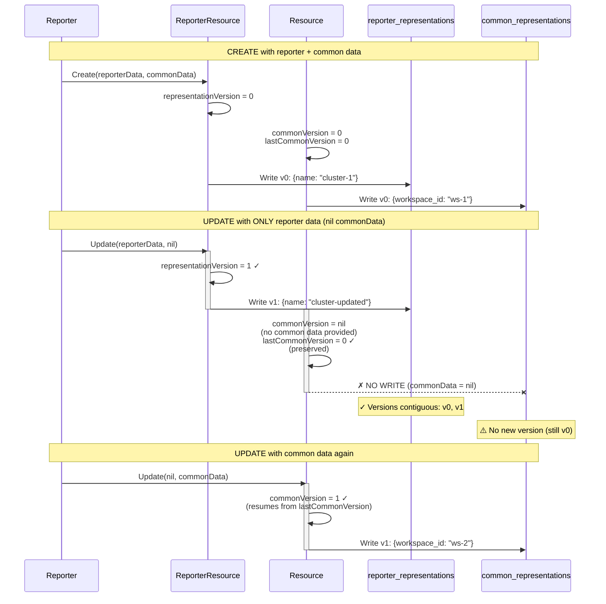

# Representation Versioning Model

## Overview

The Inventory API uses a dual-stream versioning model to track changes to resources over time. Each resource has **two independent version streams**: one for **common representations** (shared across all reporters) and one for **reporter-specific representations** (unique per reporter). Understanding this model is critical for working with resource lifecycle operations, especially deletes and tombstone handling.

This document explains:
- How the two version streams work and why they advance independently
- The version gap problem and how it's handled
- The tombstone/revival cycle and generation tracking
- Version coordinates on tuple events for each operation type
- Best practices for working with versions

**Quick Navigation:**
- [Visual Examples](#visual-examples) - Mermaid diagrams showing version progression scenarios
- [Key Concepts](#key-concepts) - Detailed explanations
- [Code Examples](#code-examples) - Go code snippets
- [Implementation References](#implementation-references) - File locations and line numbers
- [Best Practices](#best-practices) - DOs and DON'Ts

## Key Concepts

### Two Independent Version Streams

Every resource maintains two separate version streams:

1. **Common Version Stream** (`common_representations` table)
   - Tracks versions of data shared across all reporters for a resource
   - Stored in `Resource.commonVersion` and `Resource.lastCommonVersion`
   - Increments when common data changes
   - Can be `nil` when no common data has been provided

2. **Reporter Version Stream** (`reporter_representations` table)
   - Tracks versions of reporter-specific data per reporter
   - Stored in `ReporterResource.representationVersion`
   - Increments on **every update** to the reporter resource, regardless of whether reporter data is provided
   - Reset to `0` when a resource is revived from tombstone (new generation)

**Why Independent Streams?**

Reporters can provide either common data, reporter-specific data, or both in a single update. The version streams advance independently to allow:
- Common data to evolve without forcing reporter-specific changes
- Reporter metadata (API href, console href) to update without requiring data changes
- Different reporters to track their own view of a resource's lifecycle

### Version Fields on Resource

```go
type Resource struct {
    id            ResourceId
    resourceType  ResourceType
    commonVersion *Version        // Current common version (nil if no common data)
    lastCommonVersion *Version     // Highest common version ever persisted
    // ...
}
```

- **`commonVersion`**: The current version of the common representation. Set to `nil` when no common data is provided, but can be resumed later using `lastCommonVersion`.
- **`lastCommonVersion`**: The highest common representation version ever persisted for this resource. Unlike `commonVersion`, this is **never reset to nil**, allowing version numbering to resume correctly after a common-rep-less update clears `commonVersion`.

**Example:**
```
Create with common data → commonVersion = 0, lastCommonVersion = 0
Update with common data → commonVersion = 1, lastCommonVersion = 1  
Update with NO common data → commonVersion = nil, lastCommonVersion = 1
Update with common data → commonVersion = 2, lastCommonVersion = 2
```

### Version Fields on ReporterResource

```go
type ReporterResource struct {
    representationVersion Version      // Increments on every Update() or Delete()
    generation            Generation   // Increments on revival from tombstone
    tombstone             Tombstone    // Marks deleted resources
    // ...
}
```

- **`representationVersion`**: Increments unconditionally on every `Update()` or `Delete()` call, even if no reporter data is written. Resets to `0` when starting a new generation.
- **`generation`**: Increments when a tombstoned resource is revived (updated after deletion). Allows distinguishing between versions across delete/recreate cycles.
- **`tombstone`**: Boolean flag indicating whether the resource is deleted.

### The Version Asymmetry Problem

**Critical: Reporter versions are NOT contiguous.**

The `representationVersion` field increments on every update (`ReporterResource.Update()`), but `reporter_representations` rows are **only written when reporter data is provided**. This creates a fundamental asymmetry:

```go
// internal/biz/model/reporter_resource.go:93
func (rr *ReporterResource) Update(apiHref ApiHref, consoleHref *ConsoleHref) {
    rr.apiHref = apiHref
    rr.consoleHref = consoleHref
    rr.representationVersion = rr.representationVersion.Increment()  // ALWAYS increments
    rr.updatedAt = time.Now()
    if tombstoned(rr) {
        startNewGeneration(rr)
    }
}
```

But representation rows are conditionally created:

```go
// internal/biz/model/resource.go:223-239
var reporterRepresentation *ReporterDataRepresentation
if reporterData != nil {  // Only create row when data provided
    rr, err := NewReporterDataRepresentation(
        reporterResourceId,
        representationVersion,  // Uses current version
        generation,
        *reporterData,
        // ...
    )
    reporterRepresentation = &rr
}
```

**Result:** Version gaps occur when a common-only update increments `representationVersion` but doesn't write a `reporter_representations` row.

**Example Scenario:**
```
v0: Create resource with reporter data → row written at v0
v1: Update with only common data → version increments, NO row at v1 (GAP)
v2: Delete resource → tombstone at v2
```

**The Golden Rule: Never derive a neighboring version by arithmetic.**

❌ **Wrong:** `lastLiveVersion = tombstoneVersion - 1`  
✅ **Correct:** Use upper-bound queries to find the last live version

## Version Gaps and Gap-Tolerant Queries

### The Problem

Before the fix (PR #1450), delete operations used arithmetic to derive the last live reporter version:

```go
// WRONG - assumes contiguous versions
lastLiveVersion = tombstoneVersion - 1
```

This failed when a common-only update created a gap:
```
Database state:
- reporter_representations v0: {name: "test-cluster"}
- reporter_representations v1: (MISSING - gap from common-only update)
- reporter_representations v2: {tombstone: true}

Query for v1 returns nothing → delete operation fails
```

### The Solution: Gap-Tolerant Upper-Bound Queries

The fix introduced `fetchLastLiveReporterBefore`, which uses upper-bound semantics with tombstone filtering:

```go
// internal/data/resource_repository.go:485-519
func (r *resourceRepository) fetchLastLiveReporterBefore(
    db *gorm.DB, 
    key bizmodel.ReporterResourceKey, 
    beforeVersion uint, 
    beforeGeneration uint,
) (bizmodel.Representation, *bizmodel.Version, error) {
    
    // Find the most recent non-tombstone row strictly before (beforeGeneration, beforeVersion)
    query = query.Where(`
        ((rrep.generation = ? AND rrep.version < ?)
        OR rrep.generation < ?)
        AND rrep.tombstone = ?
    `, beforeGeneration, beforeVersion, beforeGeneration, false)
    
    query = query.Order("rrep.generation DESC, rrep.version DESC").Limit(1)
    // ...
}
```

This query:
1. Finds rows strictly before the tombstone version within the same generation
2. OR rows from earlier generations (handles revival after previous deletes)
3. Filters out tombstone rows
4. Orders by generation DESC, version DESC to get the most recent
5. Takes the first match → last live version before the tombstone

**Result:** Gaps are tolerated. In the example above:
```
fetchLastLiveReporterBefore(beforeVersion=2, beforeGeneration=0)
→ Finds v0 (skips missing v1) → delete operation succeeds
```

## Tombstone and Generation Lifecycle

### Generation Tracking

The `generation` field tracks delete/recreate cycles for a reporter resource:

| State | representationVersion | generation | tombstone |
|-------|----------------------|------------|-----------|
| Created | 0 | 0 | false |
| Updated | 1 | 0 | false |
| Deleted | 2 | 0 | true |
| Revived (updated after delete) | 0 | 1 | false |
| Updated again | 1 | 1 | false |
| Deleted again | 2 | 1 | true |

### The Revival Cycle

When a tombstoned resource is updated, `startNewGeneration()` is called:

```go
// internal/biz/model/reporter_resource.go:100-104
func startNewGeneration(rr *ReporterResource) {
    rr.tombstone = false
    rr.generation = rr.generation.Increment()  // 0 → 1 → 2...
    rr.representationVersion = initialReporterRepresentationVersion  // Reset to 0
}
```

This allows version `0` to be reused across generations while maintaining historical context. The `(generation, version)` tuple uniquely identifies a representation in time.

## Operation Types and Version Coordinates

### Version Information on TupleEvents

Different operation types carry different version information on their `TupleEvent` messages:

| Operation | Common Version | Reporter Version | Reporter Generation | Notes |
|-----------|---------------|------------------|---------------------|-------|
| **Created** | v0 (if provided) | v0 | g0 | Initial versions |
| **Updated** | Current (if changed) | Current (incremented) | Current | Both advance independently |
| **Deleted** | Last live (unchanged) | Tombstone (incremented) | Current | Common unchanged, reporter is tombstone |

### What the Consumer Fetches

The consumer uses different fetch strategies based on operation type:

**Create and Update Operations:**
```go
// Exact fetch for current version, upper-bound for previous
current, previous, err := repo.FindCurrentAndPreviousVersionedRepresentations(
    db, key, versions, operationType)
```

**Delete Operations:**
```go
// Special handling - uses OperationTypeDeleted for gap-tolerant fetch
// internal/data/representation_fetcher.go:48-84
if operationType.OperationType() == bizmodel.OperationTypeDeleted {
    // Common: exact fetch at event's version (already last-live, unchanged during delete)
    if currentCommonVersion != nil {
        currentCommon, currentCommonVer, err = fetcher.fetchCommon(cv)
    }
    
    // Reporter: upper-bound fetch to find last-live before tombstone
    if currentReporterVersion != nil {
        currentReporter, currentReporterVer, err = 
            fetcher.fetchLastLiveReporterBefore(rv, rg)
    }
    
    // For deletes, only "current" contains data (last-live state)
    // "previous" remains nil
}
```

**Key Insight:** Delete events carry the **tombstone version** (incremented), but the consumer fetches the **last live data** (version before tombstone) using gap-tolerant queries.

## NewResource vs Update Asymmetry

### NewResource Substitutes Empty Representation

When creating a resource with only common data (no reporter data), `NewResource` creates an **empty reporter representation** to ensure a v0 row always exists:

```go
// internal/biz/model/resource.go:29-33
func NewResource(..., reporterRepresentationData *Representation, ...) {
    if reporterRepresentationData == nil && commonRepresentationData != nil {
        emptyRep := NewEmptyRepresentation()
        reporterRepresentationData = &emptyRep  // Substitute empty rep
    }
    // ...
}
```

**Result:** Every created resource has a reporter representation at v0, even if it's empty data.

### Update Does NOT Substitute

When updating a resource with only common data (nil reporter data), `Update` does **not** substitute an empty representation:

```go
// internal/biz/model/resource.go:223-238
var reporterRepresentation *ReporterDataRepresentation
if reporterData != nil {  // No substitution - just skip
    rr, err := NewReporterDataRepresentation(...)
    reporterRepresentation = &rr
}
```

**Result:** Common-only updates increment `representationVersion` but don't write reporter rows, creating version gaps.

**Why the Asymmetry?**

- **Create:** Ensures baseline data exists (v0 is a known anchor point)
- **Update:** Avoids writing unnecessary rows for common-only updates (performance)

This asymmetry is the root cause of version gaps and why gap-tolerant delete semantics are required.

## Visual Examples

The following diagrams illustrate how version counters progress and database rows are written across different scenarios.

### Diagram 1: Normal Lifecycle (Both Data Types)



**Database State After Each Operation:**

| Operation | reporterVersion | commonVersion | reporter_representations rows | common_representations rows |
|-----------|----------------|---------------|-------------------------------|---------------------------|
| CREATE | 0 | 0 | v0 | v0 |
| UPDATE | 1 | 1 | v0, v1 | v0, v1 |

### Diagram 2: Common-Only Update (Creating Version Gap)



**Database State After Each Operation:**

| Operation | representationVersion | commonVersion | reporter_representations rows | common_representations rows |
|-----------|----------------------|---------------|-------------------------------|---------------------------|
| CREATE | 0 | 0 | v0 | v0 |
| UPDATE (common-only) | 1 | 1 | v0 **(gap at v1)** | v0, v1 |

**Key Insight:** The counter increments but no row is written, creating a gap.

### Diagram 3: Delete After Version Gap (Gap-Tolerant Recovery)



**Database State Progression:**

| Operation | representationVersion | reporter_representations rows | Delete Fetch Result |
|-----------|----------------------|-------------------------------|---------------------|
| CREATE | 0 | v0: {name: "cluster-1"} | - |
| UPDATE (common-only) | 1 | v0 **(gap at v1)** | - |
| DELETE | 2 | v0, v2: tombstone | Finds v0 (skips gap) ✓ |

**Old Broken Logic:** `fetch(version = tombstone - 1)` = `fetch(v1)` → NOT FOUND ✗  
**New Gap-Tolerant Logic:** `fetch(version < tombstone, ORDER BY DESC)` → finds v0 ✓

### Diagram 4: Delete and Revival (Generation Cycle)



**Database State Progression:**

| Operation | generation | representationVersion | tombstone | reporter_representations rows |
|-----------|-----------|----------------------|-----------|-------------------------------|
| CREATE | 0 | 0 | false | g0,v0: data |
| DELETE | 0 | 1 | true | g0,v0: data<br/>g0,v1: tombstone |
| REVIVE (Update) | 1 ✓ | 0 ✓ | false | g0,v0: data<br/>g0,v1: tombstone<br/>g1,v0: revived data |
| UPDATE | 1 | 1 | false | g0,v0: data<br/>g0,v1: tombstone<br/>g1,v0: revived data<br/>g1,v1: updated data |

**Key Insight:** Version resets to 0 when generation increments, allowing version reuse across lifecycles.

### Diagram 5: Reporter-Only Update (No Common Data)



**Database State Progression:**

| Operation | representationVersion | commonVersion | lastCommonVersion | reporter_reps rows | common_reps rows |
|-----------|----------------------|---------------|-------------------|-------------------|------------------|
| CREATE | 0 | 0 | 0 | v0 | v0 |
| UPDATE (reporter-only) | 1 | nil | 0 | v0, v1 | v0 |
| UPDATE (common-only) | 2 | 1 | 1 | v0, v1 | v0, v1 |

**Key Insight:** `lastCommonVersion` preserves the high-water mark so version numbering can resume correctly after `commonVersion` is cleared.

---

## Code Examples

### Example 1: Normal Lifecycle (No Gaps)

```go
// Create with both reporter and common data
resource, _ := NewResource(..., reporterData, commonData, ...)
// State: reporterVersion=0, commonVersion=0

// Update with both types of data
resource.Update(key, apiHref, nil, nil, newReporterData, newCommonData, txid)
// State: reporterVersion=1, commonVersion=1
// DB: reporter_representations v0, v1; common_representations v0, v1
```

**Database State:**
```
reporter_representations:
  v0: {name: "cluster-1"} 
  v1: {name: "cluster-1-updated"}

common_representations:
  v0: {workspace_id: "ws-1"}
  v1: {workspace_id: "ws-2"}
```

### Example 2: Common-Only Update (Version Gap)

```go
// Create with both data types
resource, _ := NewResource(..., reporterData, commonData, ...)
// State: reporterVersion=0, commonVersion=0

// Update with ONLY common data (reporterData = nil)
resource.Update(key, apiHref, nil, nil, nil, newCommonData, txid)
// State: representationVersion=1, commonVersion=1
// DB: reporter_representations ONLY v0 (v1 missing), common_representations v0, v1
```

**Database State:**
```
reporter_representations:
  v0: {name: "cluster-1"}
  [v1 MISSING - gap]

common_representations:
  v0: {workspace_id: "ws-1"}
  v1: {workspace_id: "ws-2"}
```

### Example 3: Delete After Common-Only Update (The Bug Scenario)

```go
// Create
resource, _ := NewResource(..., reporterData, commonData, ...)
// reporterVersion=0, commonVersion=0

// Common-only update
resource.Update(key, apiHref, nil, nil, nil, newCommonData, txid)
// reporterVersion=1 (INCREMENTED), commonVersion=1
// reporter_representations: v0 only (v1 gap)

// Delete
resource.Delete(key)
// reporterVersion=2 (tombstone), commonVersion=1 (unchanged)
// reporter_representations: v0, v2 (tombstone)
```

**Database State:**
```
reporter_representations:
  v0: {name: "cluster-1", tombstone: false}
  [v1 MISSING - gap from common-only update]
  v2: {tombstone: true}

common_representations:
  v0: {workspace_id: "ws-1"}
  v1: {workspace_id: "ws-2"}
```

**Delete Processing:**
```go
// Consumer receives delete event with reporterVersion=2, generation=0
// OLD (broken): fetchReporter(version=1) → not found (gap) → FAIL
// NEW (fixed): fetchLastLiveReporterBefore(beforeVersion=2, beforeGeneration=0)
//              → finds v0 (skips gap at v1) → SUCCESS
```

### Example 4: Generation Cycle (Delete and Revival)

```go
// Create
resource, _ := NewResource(...)
// generation=0, version=0, tombstone=false

// Delete
resource.Delete(key)
// generation=0, version=1, tombstone=true

// Revive (update after delete)
resource.Update(key, apiHref, nil, nil, reporterData, commonData, txid)
// generation=1 (INCREMENTED), version=0 (RESET), tombstone=false

// Update again
resource.Update(key, apiHref, nil, nil, reporterData, commonData, txid)
// generation=1, version=1, tombstone=false
```

**Database State:**
```
reporter_representations:
  g0,v0: {name: "cluster-1", tombstone: false}
  g0,v1: {tombstone: true}
  g1,v0: {name: "cluster-1-revived", tombstone: false}
  g1,v1: {name: "cluster-1-updated", tombstone: false}
```

## Implementation References

### Key Files

| Component | File | Lines | Description |
|-----------|------|-------|-------------|
| Version increment | `internal/biz/model/reporter_resource.go` | 87-98 | `Update()` unconditionally increments `representationVersion` |
| Conditional row write | `internal/biz/model/resource.go` | 223-239 | `ReporterDataRepresentation` only created when data provided |
| Gap-tolerant delete | `internal/data/representation_fetcher.go` | 48-84 | `OperationTypeDeleted` branch with upper-bound fetch |
| Upper-bound query | `internal/data/resource_repository.go` | 485-519 | `fetchLastLiveReporterBefore` implementation |
| Consumer delete handling | `internal/consumer/consumer.go` | 320-368 | Delete operation uses `OperationTypeDeleted` |
| Generation lifecycle | `internal/biz/model/reporter_resource.go` | 100-104 | `startNewGeneration` resets version and increments generation |

### Test Cases

| Test | File | Line | What It Demonstrates |
|------|------|------|---------------------|
| Delete after gap | `internal/data/resource_repository_test.go` | 4072 | `TestFindCurrentAndPreviousVersionedRepresentations_DeleteAfterCommonOnlyUpdate` |
| Common-only version increment | `internal/biz/model/resource_delete_bug_test.go` | 178 | `TestResource_CommonOnlyUpdate_IncrementVersionWithoutRepresentation` |
| Consumer gap handling | `internal/consumer/consumer_test.go` | 1182 | `TestInventoryConsumer_DeleteAfterCommonOnlyUpdate_TupleCleanup` |

## Best Practices

### 1. Never Use Arithmetic for Version Navigation

❌ **Wrong:**
```go
previousVersion := currentVersion - 1
```

✅ **Correct:**
```go
// Use upper-bound queries
repo.fetchPreviousReporterRepresentation(db, key, currentVersion, currentGeneration)
```

### 2. Always Check for nil Versions

Version fields can be `nil` when data hasn't been provided:

```go
if currentCommonVersion != nil {
    // Safe to use
    cv := currentCommonVersion.Uint()
} else {
    // No common data provided yet
}
```

### 3. Use OperationType for Context-Aware Fetching

Don't build custom fetch logic - use the operation type to get the right behavior:

```go
// The operation type determines fetch strategy
current, previous, err := repo.FindCurrentAndPreviousVersionedRepresentations(
    db, key, versions, operationType)  // operationType matters!
```

### 4. Understand Tombstone Filtering

When querying for representations, tombstones are filtered automatically in delete operations:

```go
// This query EXCLUDES tombstone rows
query = query.Where("rrep.tombstone = ?", false)
```

Don't assume the latest version is always live - it might be a tombstone.

### 5. Test Across Generation Boundaries

When testing delete/revival cycles, verify behavior across generations:

```go
// Create → Delete → Revive → Update → Delete again
// Ensures (generation, version) tuple handling is correct
```

## Future Considerations

### Potential Alignment of Reporter Version Increment

The current asymmetry (always increment version, conditionally write row) arose incrementally. A potential future improvement would align reporter version increments with the common version pattern - only increment when reporter data is present.

**Benefits:**
- Prevents version gaps
- Simplifies delete logic (arithmetic would be safe)
- More intuitive version sequence

**Challenges:**
- Migration-level change (changes persisted meaning of `representation_version`)
- Impact on existing databases with drifted versions
- Would require separate review and extensive testing

If gap prevention (vs. gap tolerance) is desired, this should be proposed as a separate follow-up.

### See Also

- `follow-up-tasks/reporter-version-gap-on-delete-plan.md` - Original bug report and fix plan
- `follow-up-tasks/fake-vs-real-repository-divergence.md` - Testing gaps between fake and real implementations
- `docs/dev-guides/serializable-isolation-level.md` - Transaction isolation and concurrency
- `internal/GUIDELINES.md` - General coding guidelines for domain models
